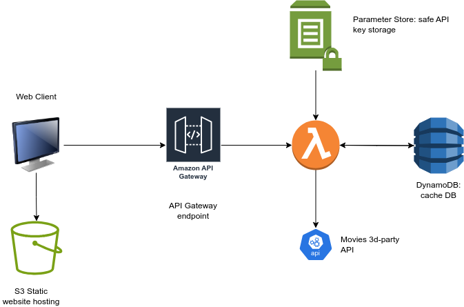

# Movies viewer app
This is the application designed to live fully on AWS and provides a functionality of searching and viewing a list of movies. Movies are fetched from an external API, however, if the same request was done earlier, than 2 minutes ago, backend will return cached value to save API request quotas.

App Preview URL: http://www-dt-assignment-2v0x7zj9.s3-website.eu-west-3.amazonaws.com/

## Architecture


Client lives in S3 as a static website hosting bucket. It is a build and deployed React application. Every search request from a client app goes to API Gateway endpoint, which is redirected to a handling lambda function. This function checks if the same request was cached within last 2 minutes, cache lives in DynamoDB table. If yes - cache hit value is reset and lambda returnes cached value, otherwise lambda fetches value of a 3rd-party API's read key and makes a request to an external API, after what the result goes to cache and is returned to the client.

### Other considered architectures
Another options for architectures were:
- Run EC2 instance with backend served from it, and using file database on the same device. | Since the workload is low, this solution is much more expensive than serverless services such as Lambda and DynamoDB
- Build a backend container with server code and DB, and use serverless runner at any request. | Provides worse development experience, than a set of separate lightweight serverless technologies


## Tech stach

### IaC
**Terraform** - platform-independent IaC declarative framework, is used to fully setup (and destroy) both backend and frontend infrastructure in cloud.
### Backend
**Node.js** - runtime\
**Typescript** - for devex and faster development\
**Jest** - for testing a service\
**AWS SDK** - for connecting to AWS Services

### Frontend
**React** - frontend framework\
**Material UI** - easy-to-use UI elements library for quick UI development


## Prerequisites
- Node.js + NPM
- Linux
- AWS account
- AWS CLI: https://docs.aws.amazon.com/cli/latest/userguide/getting-started-install.html
- Terraform: https://developer.hashicorp.com/terraform/tutorials/aws-get-started/install-cli 

## Installation
### Fast install
#### Step 1. Login to AWS
```
aws configure
```

#### Step 2. Run full install
```
sh install-all.sh
```
In the beginning script asks you to enter Movies API Read Key. This can be skipped and entered later (See step 3), however, it's more convenient to do it now.

#### Step 3. Setup read API key in AWS SSM (Optional)
Go https://eu-west-3.console.aws.amazon.com/systems-manager/parameters/ and set `/dt_assignment/read_api_key` parameter to your read api key value. Or setup value through aws cli: 
```
aws ssm put-parameter --name '/dt_assignment/read_api_key1' --value '<Your READ key here>' --overwrite
```

## Manage Infrastructure
Infrastructure code is stored in `infrastructure` folder, `/client` for client, and `/server` for server-related infrastructure. Client and server infra are not connected and can be created/removed independently. However, it is strongly recommended to follow steps in `install-all.sh`, as long as terraform runs create environment variables needed for code to run.

## Backend
All commands are to be triggered in `server` directory.
### Invoke local
To run a lambda function call once, call
```
npm run invoke:local
```

### Build and deploy
To build and deploy newest version of lambda's code without re-running Terraform launch for backend, run
```
npm run build && npm run deploy
```
This command builds lambda code into a .zip archive and deploys it to AWS account, updating lambda in cloud.

### Test
To run integration tests, execute
```
npm run test
```

## Frontend
All commands are to be triggered in `client` directory.
### Dev server
To start a development service, run
```
npm start
```

### Build & Deploy
To build the React app and deploy a new version of a client, call
```
npm run build && npm run deploy
```

### Sync bucket name
After S3 bucket for a client is created, name sync should be executed: this command takes output from Terraform run and modifies package.json, pointing deploy command to a proper bucket:
```
npm run sync-bucket-name
```
It is being done once after full install, and normally it is not needed to trigger it manually.

## Destroy cloud resources
**!! Don't forget to destroy all cloud resources after testing and playing!! Leaving resources live in cloud may lead to unwanted costs.**
```
sh destroy-all.sh
```


## Future improvements
### DevEx
- Husky <- tests run, test coverage, ESLint fix and check
- Semanthic Release
- Conventional commits

### Backend
- Store cached keys (query + page) in app's memory state for TTL to prevent querying cache DB on a brand new request
- ESLint
- SQS + EventBridge/SNS for clearing cache DB asynchronously
- Express.js runtime for testing client without triggering lambda

### Infrastructure
- TF infra as module: to replicate same setup for creating dev/staging/release/prod environments
- Use Cloudfront distribution for a website to improve load time
- Use SSL cert for https connection
- Use AWS CodePipeline / GH Actions to redeploy app on push to main
- Use remote backend for storing TF state

### Frontend
- Cypress tests for testing the app
- Using Next.js and app router in case if we have a movie page